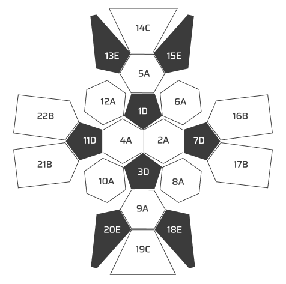
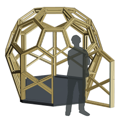

# Thiosphere
The frame to all the spaces

## Design Philosophy

Inspired by the elegant simplicity of the 1969 Porsche 911 owner's manual, the Thiosphere embodies the principle that the strongest shape requires the fewest resources. Like the 911's iconic design, we believe that form follows function through mathematical precision and engineering excellence.

## The Problem We Solve

Our modern world is designed around the automobile. Parking spaces are everywhere, yet they remain empty 95% of the time. The Thiosphere transforms these underutilized spaces into productive, climate-controlled environments that fit perfectly within the constraints of our car-centric infrastructure.

## Engineering Excellence

### Minimal Resources, Maximum Strength
The Thiosphere uses two concentric spheres - the most efficient geometric form for strength-to-material ratio. This design principle mirrors the 911's philosophy: achieve maximum performance with minimum complexity.

> "The fewest number of sides means the fewest number of parts"

### Thermal Dynamics
The spherical design creates optimal thermal dynamics through natural convection. The air gap between the two spheres acts as a thermal buffer, maintaining stable internal temperatures with minimal energy input. This passive design approach reduces energy requirements by up to 80% compared to traditional rectangular structures.

### Perfect Fit for Modern Infrastructure
Two Thiospheres fit precisely in one standard parking space, leveraging existing infrastructure without requiring new land development. This approach respects the built environment while creating new possibilities for urban agriculture.

## The Thiosphere Advantage

- **Structural Efficiency**: Spherical geometry provides maximum strength with minimum material
- **Thermal Performance**: Natural convection and thermal mass create stable microclimates
- **Infrastructure Integration**: Designed to fit existing parking spaces without modification
- **Scalable Production**: Simple geometry enables local manufacturing with basic tools
- **Energy Independence**: Passive design reduces energy requirements by 80%

## Etymology

> "Thios" is derived from the number two in Greek
> Two = δύο = "thio" ("th" pronounced like "the").  

The name reflects our core principle: two spheres working together to create something greater than the sum of their parts.

## Sustainable Urban Agriculture

Leveraging aeroponics, community-sourced growing knowledge, and local consumers, the Thiosphere enables a new model of urban agriculture. One person, acting as an agricultural "super host," can manage multiple parking spots, providing fresh, sustainable, and organic produce without the carbon footprint of traditional farming.

The Thiosphere represents a return to engineering fundamentals: solve complex problems with elegant, simple solutions that work harmoniously with existing infrastructure.  

## Construction Guide

### Materials & Tools

**Materials:**
- 2x4 lumber (pressure treated recommended for exterior use)
- 1/2" plywood for panels
- GRK FIN/Trim™ screws (recommended for clean finish)
- Silicone caulk for weatherproofing
- Paint or sealant for protection

**Tools:**
- Compound miter saw
- Table saw or circular saw
- Drill/driver
- Measuring tape
- Pencil
- Safety equipment (glasses, hearing protection)

### Step-by-Step Construction

#### 1. Prepare Your Lumber

**Cut 2x4s to required lengths:**
- **Outer dome**: 20.67" edge pieces (cut 2x4s to 20.67")
- **Inner dome**: 19.38" edge pieces (cut 2x4s to 19.38")

**Rip 2x4s for edge pieces:**
- Set table saw to 19.8° bevel angle
- Rip 2x4s to create angled edge pieces
- You'll need approximately 60 pieces for outer dome, 60 for inner dome

#### 2. Cut Compound Angles

**For Outer Dome (8' diameter):**
- **Hexagon to hexagon joints**: 20.91° compound angle
- **Hexagon to pentagon joints**: 18.69° compound angle
- **Hexagon joins**: 30° angle
- **Pentagon joins**: 36° angle

**For Inner Dome (7.5' diameter):**
- Use same angles as outer dome
- All pieces are shorter (19.38" vs 20.67")

#### 3. Assembly Process

**Start with the base ring:**
1. Lay out your first ring of pieces on a flat surface
2. Join pieces using the calculated angles
3. Use GRK screws to secure joints
4. Check for roundness and adjust as needed

**Build upward in rings:**
1. Each ring connects to the one below
2. Maintain consistent spacing between inner and outer domes
3. Use temporary supports to hold pieces in place during assembly
4. Work in sections to maintain structural integrity

#### 4. Panel Installation

**Cut plywood panels:**
- Measure each opening between frame pieces
- Cut panels to fit with 1/4" gap for expansion
- Sand edges smooth

**Install panels:**
1. Apply silicone caulk to frame edges
2. Press panels into place
3. Secure with screws around perimeter
4. Wipe excess caulk

#### 5. Weatherproofing

**Seal all joints:**
- Apply silicone caulk to all exterior joints
- Pay special attention to panel edges
- Allow 24 hours for caulk to cure

**Apply finish:**
- Paint or seal all wood surfaces
- Use exterior-grade paint for outdoor use
- Apply multiple coats for durability

### Tips for Success

- **Take your time**: Precision in cutting angles is crucial
- **Test fit**: Dry assemble sections before final assembly
- **Use jigs**: Create simple jigs to hold pieces at correct angles
- **Work in pairs**: Some assembly steps are easier with help
- **Check measurements**: Verify each piece before cutting

### Resources

- [Compound Miter Saw Calculator](https://jansson.us/jcompound.html) - Essential for calculating precise angles
- [GRK FIN/Trim™ Screws](https://grkfasteners.ca/product/fin-trim-finishing-trim-head-screw/) - Recommended for clean finish
- [McMaster-Carr Hardware](https://www.mcmaster.com/90273A572/) - For additional fasteners and hardware

### Dimensions Summary

**Outer Dome (8' diameter):**
- Edge length: 20.67"
- Pentagon diameter: 23.88"
- Hexagon diameter: 35.18"

**Inner Dome (7.5' diameter):**
- Edge length: 19.38"
- Pentagon diameter: 32.98"
- Hexagon diameter: 22.38"

**Key Angles:**
- Hex to hex: 20.91°
- Hex to penta: 18.69°
- Hex joins: 30°
- Penta joins: 36°
- 2x4 rip angle: 19.8°

