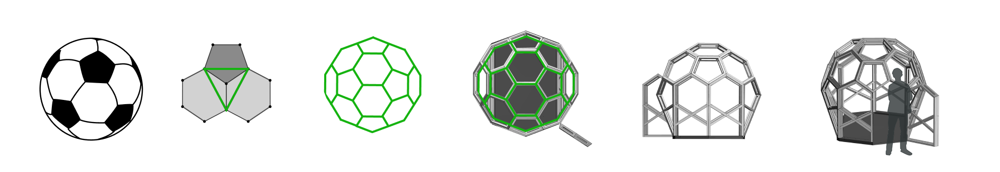
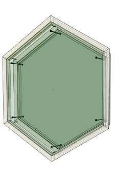

# Modular Open Source Spaces
We have formatted our world for cars, yet have little else to make use of all that space we have given over to these machines. A Thiosphere™ is created to fill that void with a purpose and beauty that defines its bold and efficient design. It is Open Source Hardware that anyone can build and modify to their own needs. 

## Introduction

One thiosphere is made from the fewest number of parts possible, yet resulting in a strong, light and roomy, modular space that only take up 1/2 of a parking spot. It is flat packable and can be assembled with common tools. It is a modular so you can create a endless number of spaces, from a simple shelter to a complex office. It is both functional and beautiful, and designed to be a second place for life to flourish - whatever, and wherever those requirments are.

### Open Source Spaces
Understanding Our Open Hardware License
The CERN Open Hardware License (Version 2 - Strongly Reciprocal) ensures that:

- All designs and modifications must be shared openly
- Commercial use is permitted with proper attribution
- Modified versions must be shared under the same license
- Original creators must be credited
- Documentation must be provided for all changes

## The Advantages

- **Built Strong**: Spherical geometry = maximum strength, minimum material
- **Stays Cool**: Natural convection keeps the environment stable inside
- **Fits Right In**: Designed for existing parking spaces - no modifications needed
- **Easy to Build**: Simple geometry means you can make it locally with basic tools
- **Energy Smart**: Passive design cuts energy needs by 80%

## What's a Thios?

> The number two in Greek is written as "δύο" and pronounced with a soft "th" sound (thío), rather than the hard "d" one might expect. This "thio" prefix perfectly describes the dual-sphere design of the Thiosphere™, a second place for life.

## Construction Guide

### What You'll Need

**Materials:**
- 180 - 2x4's
- 4 - 4'x8' sheets of plywood
- 120 - nuts and bolts
- 800 - wood screws
- 4 casters, a small trailer or a leveling plinth (optional)

**Tools:**
- Compound miter saw
- Table saw or circular saw
- Drill/driver
- Measuring tape
- Pencil
- Safety gear (glasses, hearing protection)

### Step-by-Step Build

#### 1. Prep Your Wood

**Cut 2x4s to length:**
- **Outer dome**: 20.67" edge pieces
- **Inner dome**: 19.38" edge pieces

**Rip 2x4s for edge pieces:**
- Set table saw to 19.8° bevel angle
- Rip 2x4s to create angled edge pieces
- You'll need about 60 pieces for outer dome, 60 for inner dome

#### 2. Cut Those Angles

**For Outer Dome (8' diameter):**
- **Hexagon to hexagon joints**: 20.91° compound angle
- **Hexagon to pentagon joints**: 18.69° compound angle
- **Hexagon joins**: 30° angle
- **Pentagon joins**: 36° angle

**For Inner Dome (7.5' diameter):**
- Same angles as outer dome
- All pieces are shorter (19.38" vs 20.67")

#### 3. Put It Together

**Start with the base ring:**
1. Lay out your first ring of pieces on a flat surface
2. Join pieces using the calculated angles
3. Use GRK screws to secure joints
4. Check for roundness and adjust as needed

**Build upward in rings:**
1. Each ring connects to the one below
2. Keep consistent spacing between inner and outer domes
3. Use temporary supports to hold pieces in place
4. Work in sections to keep it solid

#### 4. Add the Panels

**Cut plywood panels:**
- Measure each opening between frame pieces
- Cut panels to fit with 1/4" gap for expansion
- Sand edges smooth

**Install panels:**
1. Apply silicone caulk to frame edges
2. Press panels into place
3. Secure with screws around perimeter
4. Wipe excess caulk

#### 5. Weatherproof It

**Seal all joints:**
- Apply silicone caulk to all exterior joints
- Pay special attention to panel edges
- Let it cure for 24 hours

**Apply finish:**
- Paint or seal all wood surfaces
- Use exterior-grade paint for outside use
- Apply multiple coats for durability

### Pro Tips

- **Take your time**: Precision in cutting angles is key
- **Test fit**: Dry assemble sections before final assembly
- **Use jigs**: Create simple jigs to hold pieces at correct angles
- **Work in pairs**: Some assembly steps are easier with help
- **Check measurements**: Verify each piece before cutting

### Resources

- [Compound Miter Saw Calculator](https://jansson.us/jcompound.html) - Essential for calculating precise angles
- [GRK FIN/Trim™ Screws](https://grkfasteners.ca/product/fin-trim-finishing-trim-head-screw/) - Recommended for clean finish
- [McMaster-Carr Hardware](https://www.mcmaster.com/90273A572/) - For additional fasteners and hardware

### Quick Reference

Outer Dome (8' diameter):
- Edge length: 20.67"
- Pentagon diameter: 23.88"
- Hexagon diameter: 35.18"

Inner Dome (7.5' diameter):
- Edge length: 19.38"
- Pentagon diameter: 32.98"
- Hexagon diameter: 22.38"

Key Angles:
- Hex to hex: 20.91°
- Hex to penta: 18.69°
- Hex joins: 30°
- Penta joins: 36°
- 2x4 rip angle: 19.8°

Thoispheres - Domus Opus Est, (the work of creating space is never ending).